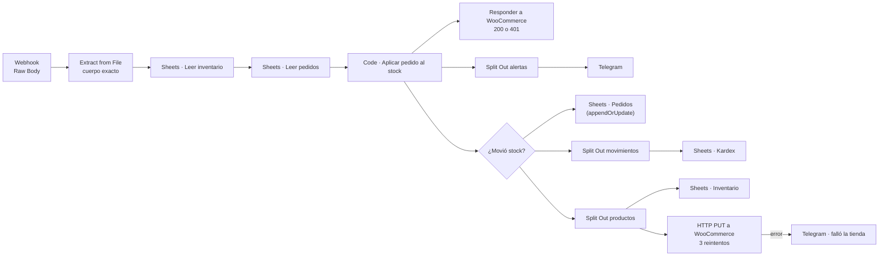

# Guía técnica: sincronización de tienda online

Cómo poner el flujo en producción, cómo está construido y qué límites tiene.
Para probarlo rápido basta el [README](README.md).

---

## 1. Arquitectura



| Nodo | Qué hace |
| --- | --- |
| **Webhook · Pedido de WooCommerce** | Con la opción *Raw Body* activada, guarda el cuerpo tal como llegó. |
| **Leer cuerpo exacto** | *Extract from File*, operación texto: deja el cuerpo como texto sin reinterpretarlo. |
| **Sheets · Leer inventario / pedidos** | Con *Execute Once* y *Always Output Data*: leen una vez, aunque la hoja esté vacía. |
| **Aplicar pedido al stock** | Verifica la firma, decide y calcula movimientos, alertas y el stock que hay que copiar a la tienda. |
| **Responder a WooCommerce** | Responde enseguida con 200 o 401. WooCommerce desactiva un webhook después de varios avisos fallidos. |
| **Sheets · Guardar estado del pedido** | `appendOrUpdate` por `pedido_id`. Es la memoria que hace al flujo idempotente. |
| **WooCommerce · Actualizar stock** | `PUT /wp-json/wc/v3/products/{id}` con `stock_quantity`. 3 intentos con 3 s entre cada uno; si falla, avisa por Telegram con el stock correcto. |

### La hoja es la fuente de verdad

El stock correcto vive en Google Sheets y se copia a WooCommerce. Así, si el
local vende en caja y alguien descuenta en la hoja, la web se corrige con el
siguiente pedido. Por el mismo motivo, en WooCommerce conviene que el stock lo
maneje este flujo y no el ajuste automático de la tienda (ver 2.1).

---

## 2. Puesta en producción

### 2.1 WooCommerce

1. **WooCommerce → Ajustes → Avanzado → Webhooks → Añadir webhook.** Crea dos,
   con la misma URL y la misma clave: uno con el tema *Pedido creado* y otro con
   *Pedido actualizado*. Si llegan los dos por el mismo pedido, no pasa nada: el
   flujo mueve el stock una sola vez.
   - URL de entrega: `https://TU-N8N/webhook/woocommerce-pedidos`.
   - Clave secreta: una cadena larga y aleatoria. Guárdala: es `WC_WEBHOOK_SECRET`.
   - Versión de la API: *WP REST API Integration v3*.
2. **Ajustes → Avanzado → REST API → Añadir clave** con permisos de lectura y
   escritura. Te da una *consumer key* (`ck_…`) y un *consumer secret* (`cs_…`).
3. Si WooCommerce también descuenta stock por su cuenta, el stock se restaría
   dos veces. Decide cuál manda: con este flujo como fuente de verdad, su PUT
   deja el número correcto después de cada pedido.

### 2.2 Servidor de n8n

El nodo Code necesita tres variables de entorno (ya están en `docker-compose.yml`):

| Variable | Para qué |
| --- | --- |
| `WC_WEBHOOK_SECRET` | La clave secreta del webhook. Nunca se escribe en el workflow. |
| `NODE_FUNCTION_ALLOW_BUILTIN=crypto` | Permite usar el módulo `crypto` de Node dentro del nodo Code para calcular la firma. |
| `N8N_BLOCK_ENV_ACCESS_IN_NODE=false` | Permite leer `$env.WC_WEBHOOK_SECRET`. En n8n 2.x viene bloqueado por defecto. |

Si falta `WC_WEBHOOK_SECRET`, el flujo **rechaza todos los avisos**. Es
preferible a aceptar pedidos sin verificar.

### 2.3 Hoja de cálculo

Una Google Sheet con tres pestañas (columnas en la fila 1):

```
Inventario:  sku | nombre | stock | minimo | product_id
Pedidos:     pedido_id | estado_stock | actualizado
Kardex:      pedido_id | accion | fecha | sku | nombre | cantidad | stock_antes | stock_despues
```

`product_id` es el ID del producto en WooCommerce (aparece en la URL al
editarlo). `minimo` es el nivel que dispara la alerta de stock bajo.

### 2.4 Reemplazos en el workflow

| Nodo | Qué reemplazar |
| --- | --- |
| Los 5 nodos de Google Sheets | `REEMPLAZAR_ID_HOJA` y la credencial de Google |
| WooCommerce · Actualizar stock | `REEMPLAZAR_URL_TIENDA` (por ejemplo `https://mitienda.pe`) y una credencial *Basic Auth* con la consumer key como usuario y el consumer secret como contraseña |
| Los 2 nodos de Telegram | `REEMPLAZAR_CHAT_EQUIPO` y la credencial del bot |

---

## 3. Límites conocidos

- **Avisos simultáneos del mismo producto.** Si llegan dos pedidos en el mismo
  instante, cada ejecución lee la hoja antes de que la otra escriba y una de
  las dos ventas podría perderse en el conteo. Con el volumen de una tienda
  pequeña es raro. Para volumen alto conviene cambiar la hoja por una base de
  datos con transacciones (Postgres) o procesar los avisos en cola.
- **Variaciones de producto** (talla, color): el flujo usa el SKU de cada
  línea. Si cada variación tiene su propio SKU en WooCommerce funciona igual,
  pero el PUT debe ir a `/products/{padre}/variations/{id}`.
- **Pedidos editados después de pagar** (se agrega un producto): no se
  recalculan, porque el pedido ya figura como descontado. Es la regla que
  protege de los reintentos.

---

## 4. Decisiones de diseño

- **Verificar antes de leer.** El cuerpo no se interpreta hasta confirmar la
  firma; un aviso falso ni siquiera llega a mostrar su número de pedido.
- **Comparación de firmas en tiempo constante** (`timingSafeEqual` en Node,
  `compare_digest` en Python), para no dar pistas a quien intente adivinarla.
- **Responder primero.** La respuesta a WooCommerce sale antes de escribir en
  la hoja o llamar a la API de la tienda.
- **Sin credenciales en el repositorio.** La clave va por variable de entorno y
  un test verifica que el workflow de producción no lleve la clave de la demo.

---

## 5. Problemas de n8n encontrados al probar

- **El nodo Code no recibe el aviso en producción.** Como el Code va después
  de leer la hoja, `$input` trae las filas del inventario y no el pedido. Por
  eso el cuerpo se lee por nombre (`$('Leer cuerpo exacto')`) y no con
  `getBinaryDataBuffer`, que solo lee el binario del `$input`.
- **El aviso de prueba de WooCommerce no es JSON.** Llega como formulario
  (`webhook_id=12`). El flujo lo responde con 200 para que WooCommerce no
  marque el webhook como fallido.
- **Split Out con una lista vacía no genera items.** Un pedido sin alertas no
  llega a Telegram, sin necesidad de un IF adicional.
- **Reimportar un workflow activo no cambia la versión activa** (n8n 2.x):
  desactívalo, impórtalo y vuelve a activarlo.
