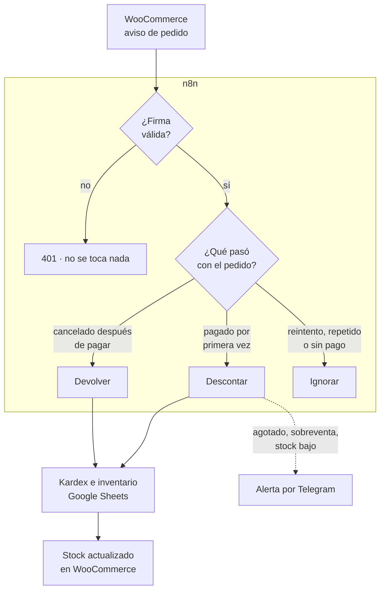
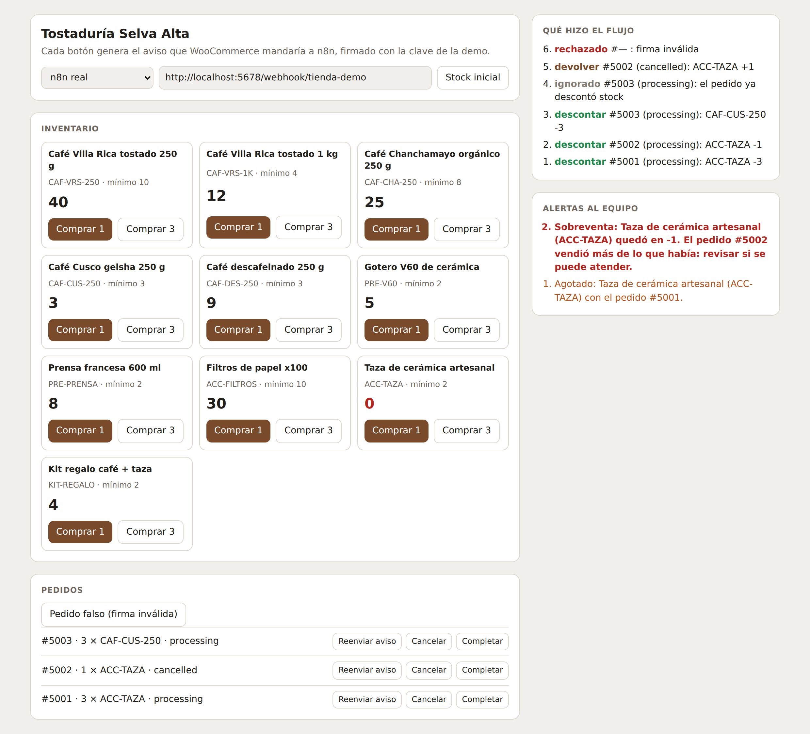

<h1 align="center">Sincronización de tienda online con n8n</h1>

<p align="center"><i>Cada pedido mueve el stock una sola vez, y nadie se entera de un agotado por un cliente molesto</i></p>

<p align="center">
  
  
  
  
  
</p>

---

## Para qué existe este repositorio

Una tienda vende por WooCommerce y también en su local. El stock se lleva en una hoja de cálculo que alguien actualiza a mano al final del día. Mientras tanto, la web sigue vendiendo productos que ya se acabaron, nadie avisa cuando algo baja del mínimo y un pedido cancelado a veces devuelve stock que nunca se había descontado.

**Este flujo recibe cada aviso de pedido de WooCommerce, verifica que sea auténtico, mueve el stock una sola vez por pedido, registra el movimiento, copia el stock correcto a la tienda y avisa al equipo cuando algo se agota o se vende de más.**



---

## Demo

<!-- VIDEO: arrastra aquí el .mp4 al editar el README en GitHub y deja solo la URL que genera. -->

<p align="center"></p>

<p align="center"><i>La tienda de demostración conectada al workflow de n8n: se venden las
últimas tazas, un reenvío del mismo aviso se ignora, una cancelación devuelve
stock y un pedido con firma falsa se rechaza.</i></p>

---

## Tres problemas que un flujo ingenuo no ve

Términos que conviene conocer:

- **Webhook:** el aviso que WooCommerce envía automáticamente a una URL cada vez que un pedido cambia.
- **Firma HMAC-SHA256:** WooCommerce calcula un código a partir del contenido del aviso y una clave secreta que solo conocen la tienda y n8n. Si alguien cambia un solo carácter o no tiene la clave, el código no coincide.
- **Idempotencia:** procesar el mismo aviso dos veces da el mismo resultado que procesarlo una vez.
- **Kardex:** el registro de cada entrada y salida de stock, con el pedido que la causó.

| Problema | Qué pasaría sin cuidarlo | Qué hace este flujo |
| --- | --- | --- |
| WooCommerce **reintenta** el aviso si no recibe respuesta, y manda uno nuevo cada vez que alguien toca el pedido | Cada aviso descuenta otra vez y el inventario se vacía solo | El stock se mueve **una vez por pedido**. El estado de cada pedido queda guardado en la hoja |
| Cualquiera que conozca la URL del webhook puede **inventar pedidos** | Un pedido falso descuenta stock real | Se verifica la **firma** sobre el cuerpo exacto; sin firma válida responde 401 y no toca nada |
| Un pedido se **cancela sin haber pagado** | Se "devuelve" stock que nunca salió y el inventario se infla | Solo se devuelve si antes se había descontado |

---

## Probarlo en 2 minutos

```bash
pip install pytest
python scripts/simular_dia.py        # 17 avisos de un día, con sus decisiones
python -m pytest -v                  # 49 tests
```

También puedes abrir `demo/index.html` con doble clic: en modo simulado
funciona sin instalar nada.

**Con n8n de verdad** (Docker):

```bash
docker compose up -d
docker exec tienda_n8n n8n import:workflow --input=/workflows/tienda_demo.json
docker exec tienda_n8n n8n update:workflow --id=tiendademo --active=true
docker restart tienda_n8n
```

En la demo elige **n8n real**: cada botón firma el aviso en el navegador y lo
manda al workflow. La configuración de producción (WooCommerce, Google Sheets y
Telegram) está en [`GUIA.md`](GUIA.md).

---

## Cómo se mide que funciona

`scripts/generar_eventos.py` escribe un día de 17 avisos firmados, uno por
cada situación difícil, con la decisión esperada:

| Situación | Decisión |
| --- | --- |
| Pedido pagado | Descontar |
| Mismo aviso reintentado, o reenviado con otro formato de JSON | Ignorar |
| Pedido pagado y luego completado | Descontar una sola vez |
| Cancelado o reembolsado después de pagar | Devolver |
| Cancelado sin haber pagado | Ignorar |
| Se venden las últimas unidades, o más de las que hay | Descontar + alerta de agotado o sobreventa |
| Pedido con un SKU que no está en el inventario | Descontar el resto + alerta |
| Firma falsa, o cuerpo alterado después de firmar | Rechazar con 401 |
| Aviso de prueba que manda WooCommerce al crear el webhook | Ignorar sin error |

Resultado: **17 de 17** decisiones correctas, en Python y en n8n real (los 17
avisos se enviaron por HTTP al workflow y el stock final coincidió con la
simulación). Un test comprueba además que el stock final sea exactamente el
inicial más la suma del kardex.

---

### El detalle que más cuesta ver

La firma se calcula sobre los **bytes exactos** que mandó WooCommerce. Si n8n
interpreta el JSON y lo vuelve a convertir en texto, cambian los espacios y la
firma ya no coincide, aunque el pedido sea legítimo. Por eso el webhook guarda
el cuerpo crudo (*Raw Body*) y un nodo *Extract from File* lo convierte en
texto sin tocarlo, antes de verificar nada.

La lógica existe dos veces, en Python y en el nodo Code de n8n. Un test
**ejecuta el nodo fuera de n8n** y compara aviso por aviso, incluidos cantidades
como `"2"`, `2.0` o `true`, que un lenguaje acepta y el otro no si no se cuida.

---

## Estructura

```
├── data/
│   ├── inventario.json              # 10 productos de una tostaduría ficticia
│   └── eventos.json                 # 17 avisos firmados con la decisión esperada
├── src/sync_tienda.py               # firma, idempotencia, movimientos y alertas
├── workflows/
│   ├── src/sincronizar_pedido.js    # el código del nodo de n8n
│   ├── tienda_demo.json             # importable, corre SIN credenciales
│   └── tienda_produccion.json       # WooCommerce + Google Sheets + Telegram
├── demo/                            # tienda de prueba: simulada o conectada a n8n
├── scripts/                         # generador de avisos, simulación y build
├── tests/                           # 49 tests (incluye paridad JS ↔ Python)
└── docker-compose.yml               # n8n self-hosted
```

---

## Flujo de trabajo con Git

El repositorio sigue **Git Flow**: `main` siempre desplegable, `develop` como
integración, y una rama por cambio. Los merges son `--no-ff` para que cada
funcionalidad quede como un bloque legible en el historial, y cada versión
lleva su tag.

| Rama | Para qué |
| --- | --- |
| `main` | Solo versiones liberadas. Cada merge lleva su tag. |
| `develop` | Integración de todo lo terminado. |
| `feature/*` | Una funcionalidad nueva. |
| `fix/*` | Una corrección concreta. |
| `release/*` | Preparación de la versión; luego se fusiona a `main` y `develop`. |

Los mensajes siguen [Conventional Commits](https://www.conventionalcommits.org/):
`feat:`, `fix:`, `test:`, `docs:`, `chore:`, con el porqué del cambio en el cuerpo.

---

## Documentación

| Documento | Contenido |
| --- | --- |
| [`GUIA.md`](GUIA.md) | Puesta en producción, arquitectura, límites y problemas de n8n encontrados al probar |
| [`CHANGELOG.md`](CHANGELOG.md) | Cambios por versión |

---

## Licencia

[MIT](LICENSE) · Daniel Yataco Blas

> Proyecto de demostración construido con **datos ficticios**. La tienda, sus
> productos y los pedidos no existen. La clave de firma de la demo es pública
> a propósito; en producción se usa la de WooCommerce.
